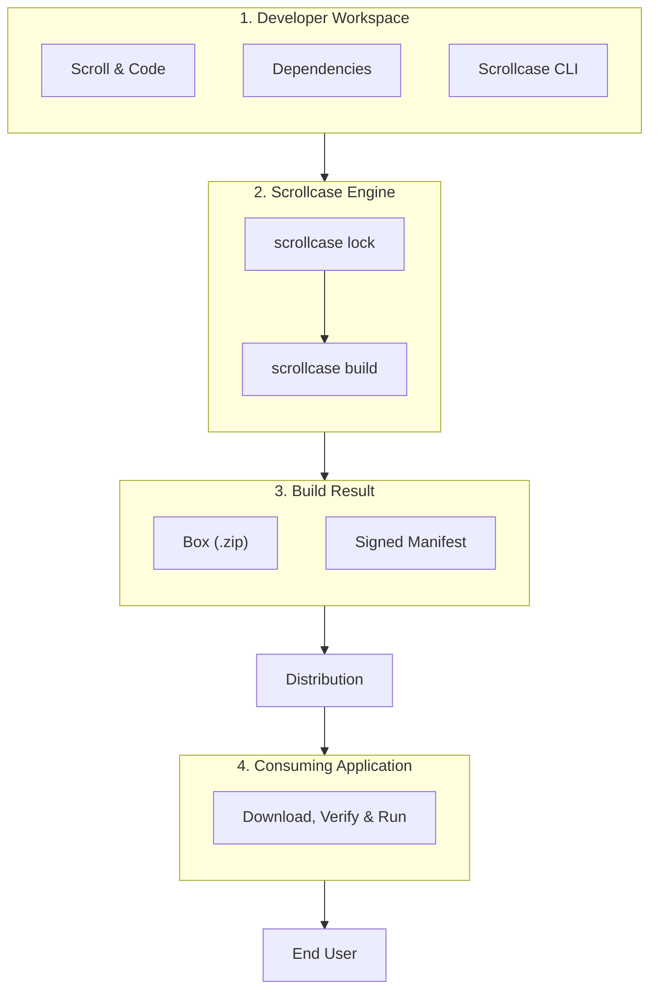

# TL;DR

The Scrollcase mental model is simple:

```text
write a scroll
↓
define and lock dependencies
↓
build the box
```

A scroll names one **target** — the machine the box is for — and one **runtime**, which is what
starts inside it: `python`, `node`, or `native`, which runs a compiled binary and carries no
interpreter. The three steps above are the same whichever you pick.



## Initial setup

1. run `npm install -g scrollcase` to install the [CLI](/reference/cli)
2. run `scrollcase init` to create the workspace and a runnable example for your own machine
3. optionally run `scrollcase new scroll` for real project metadata
4. review the selected [scroll](/reference/scroll)
5. define the **dependencies** with `scrollcase add dep <box> <name>`, and declare the model files
   with `scrollcase add asset <box> <url>`
6. run `scrollcase lock <boxId>/<targetId>`
7. generate or configure the [signing key](/guides/signing-and-custody)
8. run `scrollcase build <boxId>/<targetId>`

## Normal update

1. update code, version, model files, or dependencies
2. re-run `scrollcase lock <boxId>/<targetId>` only when required
3. run `scrollcase build <boxId>/<targetId>`

## Responsibility split

<Tabs :titles="['The Developer', 'Scrollcase', 'The Consuming Application', 'The End User']">
<Tab title="The Developer">

Decides what the box contains, writes the scroll, defines dependencies, runs the commands, publishes releases, and implements integration in the application.

</Tab>
<Tab title="Scrollcase">

Builds the environment, downloads and verifies assets, prepares the box, runs tests, creates archives, generates manifests, calculates hashes, and signs the release.

</Tab>
<Tab title="The Consuming Application">

Selects and downloads the box, supplies local inputs to a conforming consumer, and manages updates,
activation, rollback, and removal.

</Tab>
<Tab title="The End User">

Uses the feature exposed by the application; does not interact with Scrollcase directly.

</Tab>
</Tabs>


The most demanding parts are usually:

- defining a correct scroll;
- dealing with difficult scientific dependencies;
- integrating distribution and lifecycle policy with the Node or Python consumer.

Conceptually, Scrollcase is therefore fairly linear: the developer declares the desired environment, and the tool turns that declaration into a distributable and verifiable release.

## What Scrollcase simplifies

Scrollcase removes much of the repetitive work required to turn an environment — Python, Node, or a compiled binary with no interpreter at all — into a distributable product.

Without a tool like this, the developer would have to manage:

- environment creation;
- exact dependency versions;
- relocatability;
- native dependencies;
- verified downloads;
- manifests;
- signatures;
- hashes;
- release structure;
- tests;
- distribution conventions.

With Scrollcase, these concerns are collected into a scroll and a small number of commands.
