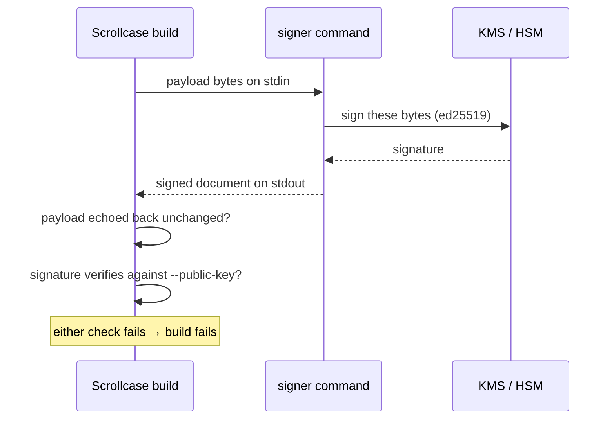

# Signing & Key Custody

A box is only worth as much as the signature over its release document. Scrollcase ships a
working signer so anyone gets verifiable boxes with no infrastructure, and a plug for operators
who hold their keys somewhere serious — without ever learning anything about the custody model.

## The local key

```sh
scrollcase keygen
```

Writes two files into the workspace's keys directory:

| File | What it is |
| --- | --- |
| `signing-private.pem` | The ed25519 private key, PKCS#8 PEM, written **owner-only** (`0600`) |
| `signing-public.json` | The trust anchor: algorithm, key ID, raw public key in base64, and the PEM |

The key ID is derived from the key itself (`scrollcase-<first 16 hex of its hash>`), so it is
stable and collision-resistant without a registry. Override it with `--key-id`.

```jsonc
{
  "algorithm": "ed25519",
  "keyId": "scrollcase-9f2b7c1e04a83d56",
  "publicKeyBase64": "kV3x…=",
  "publicKeyPem": "-----BEGIN PUBLIC KEY-----\n…\n-----END PUBLIC KEY-----\n"
}
```

::: danger Never commit the private key
`init` adds `.scrollcase/` to `.gitignore` for exactly this reason. Keep the PEM out of history,
backups, and CI logs. Copy the public file to a tracked, project-owned trust directory and name it
explicitly:

```sh
mkdir -p trust
cp .scrollcase/keys/signing-public.json trust/scrollcase-signing-public.json
git add trust/scrollcase-signing-public.json
scrollcase verify release.json --public-key trust/scrollcase-signing-public.json
```
:::

`keygen` refuses to overwrite an existing key without `--force`, because rotating silently would
invalidate every document previously signed with it, with no way to tell which. Never use
`keygen --force` as a mismatch repair or rotation procedure.

## What gets signed

Two documents per build, each independently signed:

- the **release manifest** — immutable, committing to the archive by size and SHA-256;
- the **channel pointer** — mutable, naming which release the channel currently serves. Signing
  it separately is what lets you promote a build without re-signing it.

The payload is serialised once and both hashed and signed as-is, so **what is signed is
byte-for-byte what is published**. Details of the envelope in
[The Box Format](/reference/box-format#signed-documents).

## Verifying

```sh
scrollcase verify .scrollcase/dist/boxes/my-model/1.0.0/macos-aarch64-metal/*.release.json --self-test
```

Verification loads the trusted key file (`--public-key`, default `<keys>/signing-public.json`)
and accepts the document when **any one** of its signatures verifies against a trusted key. The
file may hold a single key, or a bundle:

```jsonc
{
  "keys": [
    { "algorithm": "ed25519", "keyId": "scrollcase-9f2b…", "publicKeyPem": "…" },
    { "algorithm": "ed25519", "keyId": "scrollcase-4c7e…", "publicKeyPem": "…" }
  ]
}
```

That is also the mechanism for rotation, below.

## External signers {#external-signers}

An operator with real key custody — a KMS, an HSM, a signing service — configures a command
instead of a local key. The private key never touches the build machine.

```sh
scrollcase build my-model/macos-aarch64-metal \
  --signer-command "./tools/kms-sign.sh" \
  --public-key ./trust/production-keys.json
```

When the command itself needs arguments, pass the whole value as one shell argument; quoted groups
inside it are preserved, including executable and argument paths containing spaces:

```sh
scrollcase build my-model/macos-aarch64-metal \
  --signer-command '"/opt/signing tools/kms-sign" --key "production release"'
```

The contract is the simplest thing that composes with anything:

1. The command receives the **payload bytes on stdin**.
2. It writes the **complete signed document as JSON on stdout**.
3. A non-zero exit, or non-JSON output, fails the build.

Any language, any credential mechanism, no plugin API to keep compatible.



### The signer is not trusted on its word

Two checks run on what comes back, before the build continues:

- **The returned document must echo back the exact payload it was given.** A signer that
  substitutes a payload fails the build instead of producing a box nobody can install.
- **Its signature is verified locally**, against the trust anchor `--public-key` names — not
  against the signer's claim.

### A minimal signer

```sh
#!/bin/sh
# Reads payload bytes on stdin, prints a signed document on stdout.
set -eu
payload=$(mktemp); trap 'rm -f "$payload"' EXIT
cat > "$payload"

payload_b64=$(base64 < "$payload" | tr -d '\n')
payload_sha=$(shasum -a 256 "$payload" | cut -d' ' -f1)
signature_b64=$(your-kms sign --key-id "$KEY_ID" --algorithm ed25519 --input "$payload")

cat <<JSON
{
  "schemaVersion": 3,
  "payloadEncoding": "base64-json-utf8",
  "payloadBase64": "$payload_b64",
  "payloadSha256": "$payload_sha",
  "signatures": [
    { "algorithm": "ed25519", "keyId": "$KEY_ID", "signatureBase64": "$signature_b64" }
  ]
}
JSON
```

The signature is over the **decoded payload bytes** — the same bytes that arrived on stdin — not
over the base64 text and not over a re-serialised object. `ed25519` is the only algorithm the
format defines.

::: warning Only provider-agnostic by design
There is deliberately no built-in KMS integration. Cloud-specific authentication inside a
packaging tool ages badly and excludes everyone using something else. A five-line shell script is
the whole integration surface.
:::

## Rotating a key

Signature verification accepts a document when any one signature matches a trusted key, so a
rotation does not invalidate what is already published:

1. Preserve the outgoing public key and record its key ID before changing anything.
2. Generate the incoming key under **different explicit paths**, or provision a distinct KMS key:

   ```sh
   scrollcase keygen --key-id release-2026 \
     --private-key .scrollcase/keys/release-2026-private.pem \
     --public-key .scrollcase/keys/release-2026-public.json
   ```

3. Publish a reviewed trust bundle containing both outgoing and incoming public keys.
4. Wait until consumers have received that bundle.
5. Switch new builds to the incoming private key or external signer.
6. Remove the outgoing public key only after the compatibility window.

Documents signed under the old key stay verifiable throughout, because their key is still in the
bundle — and stop being accepted the moment you remove it, which is the point.

If a key is compromised, rotating is not enough on its own: the releases it signed need
withdrawing too. The format defines a [revocations
manifest](/reference/box-format#revocations-manifest) for that; publishing and serving it belongs
to whatever distributes your boxes.

## Key custody in CI

The private key should not exist as a file on a shared runner. In order of preference:

1. **External signer.** The runner holds a credential that can *request* a signature, never the
   key. `--signer-command` plus a short-lived cloud identity is the supported custody boundary.
2. **Secret-injected key.** If you must, write the PEM from a secret to a path outside the
   workspace, `chmod 600` it, pass `--private-key`, and delete it in a cleanup step that runs
   even on failure. Never let it reach logs or a cached directory.

Scrollcase does not have an unsigned-build/later-sign workflow: `build` emits signed release and
channel documents as one pipeline. Whichever custody path you choose, `--public-key` should point
at a trust file that is **reviewed and committed**, since it decides which signatures count.

Scrollcase ships the revocations schema, and its generic signing and envelope-verification APIs
can carry that document. Distribution, freshness policy, semantic enforcement, and any registry
belong to the project that distributes boxes.
