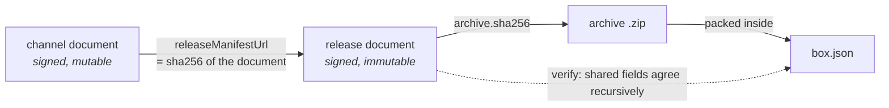

# The Box Format

The format is the product. This page is the v2 contract a builder, a signer, and any client — in any
language — must agree on. Active documents carry `schemaVersion: 2`; v1 is rejected rather than
silently reinterpreted.

The normative artefacts ship inside the npm package:

| Artefact | Where | What it is |
| --- | --- | --- |
| Reference implementation | `scrollcase/contract` | The rules as executable code |
| JSON Schemas | `scrollcase/contract/schema/*.json` and `/schema/v2/*.json` | The machine-readable spec, package-local or public |
| Golden fixtures | `scrollcase/contract/fixtures/*.json` | What "agreeing" means, concretely |

A client written in another language **does not import the code** — it mirrors the rules and
proves the mirror against `fixtures/target-id-contract.json`,
`fixtures/payload-digest-contract.json`, and the shared consumer conformance matrix. That is how
implementations stay honest without sharing a runtime.

## Targets

A target is the `(platform, arch, accelerator)` triple a box is built for, plus a CUDA ABI
version when the accelerator is CUDA. The supported matrix is closed:

| `platform` | `arch` | `accelerator` | conda subdir | Interpreter |
| --- | --- | --- | --- | --- |
| `macos` | `aarch64` | `metal`, `cpu` | `osx-arm64` | `venv/bin/python` |
| `linux` | `x86_64` | `cpu`, `cuda` | `linux-64` | `venv/bin/python` |
| `windows` | `x86_64` | `cpu`, `cuda` | `win-64` | `venv/python.exe` |

### Target identity

`boxTargetId()` turns a target into the canonical slug that appears in archive names, object
keys, and routes. Every implementation must produce it character for character:

```text
macos-aarch64-metal
macos-aarch64-cpu
linux-x86_64-cpu
linux-x86_64-cuda12.4
windows-x86_64-cpu
windows-x86_64-cuda12.4
```

The rule: `<platform>-<arch>-<accelerator>`, except CUDA, which appends the version with no
separator — `cuda12.4`. `cudaVersion` is **required for CUDA and forbidden for everything else**,
so an identifier is never ambiguous.

These, and the invalid cases that must be rejected, are the golden fixtures in
`fixtures/target-id-contract.json`.

### Target adapters

Each target also carries what it implies for the built payload: the Python layout, the archive
backend, how native libraries are inspected, the environment a validation run gets, and the
platform assertion the self-test prepends. Consumers unpacking a box rely on that layout, so it
is part of the format rather than an implementation detail.

## The archive

A box ships as a ZIP (ZIP64-capable) whose bytes depend only on its contents:

```text
example-model-1.0.0-macos-aarch64-metal.zip
├── box.json                                 # the self-describing manifest
├── payload-digest.v1                        # canonical hashes of every original payload entry
├── venv/                                    # the packed, relocated conda-forge environment
│   ├── bin/python                           # (venv/python.exe on Windows)
│   ├── lib/…
│   └── conda-meta/…
├── model-cache/…                            # assets, when weights are embedded
└── THIRD_PARTY_NOTICES/
    └── conda-distributions.json             # the dependency licence inventory
```

Guarantees the archive layer enforces:

- **Deterministic.** Fixed timestamps (`2000-01-01T00:00:00Z`), stable file ordering, and modes
  derived from the target adapter. The same commit rebuilds to identical bytes.
- **Links only where they are provably safe.** A symbolic link is carried when its target is
  relative, resolves inside the payload, and ends at a regular file. Everything else — an absolute
  target, one that climbs out through `..`, a link to a directory, a cycle — is materialised into
  real content instead, and no entry may have a link as a path prefix, so nothing is ever written
  *through* one. Windows boxes carry no links at all, because creating one there needs elevation.
  Special entries are rejected outright.

  This is not a convenience: a conda prefix stores every large shared library two or three times
  through the soname convention, and materialising all of it made most of an extracted Linux box
  duplicates of its own bytes. See [Design decisions](/concepts/design-decisions).
- **Safe to extract.** Entry names are validated against path traversal on the way out, by both
  `verify` and any conforming client.
- **Relocatable.** Nothing inside depends on the build machine's paths — see
  [Architecture](/concepts/architecture#relocation).

## `box.json`

The manifest packed **inside** the archive, so an extracted box is self-describing: a consumer
holding the directory but not the release document can still tell what it is and how it was
built.

The application inside the box can read it too, and that is the supported way to find the box's own
files. An entry point sitting at the payload root reaches its model with:

```python
root = Path(__file__).resolve().parent
model = root / json.loads((root / "box.json").read_text())["modelCacheSubdir"]
```

Rather than a hard-coded path, which the scroll then has to be bent to match and which drifts
silently the day either side changes. `box.json` is written before the self-test runs, so a check
written this way exercises the same layout the shipped box has.

```jsonc
{
  "schemaVersion": 2,
  "boxId": "example-model",
  "modelId": "example-org-example-model",
  "runtimeId": "example-model-runtime",
  "version": "1.0.0",
  "target": { "platform": "macos", "arch": "aarch64", "accelerator": "metal" },
  "pythonEntryPoint": "venv/bin/python",
  "modelCacheSubdir": "model-cache/example",
  "environment": { "MODEL_ROOT": "model-cache/example" },
  "selfTest": { "pythonImports": ["json", "sqlite3"], "timeoutSeconds": 180 },
  "provenance": { "…": "see below" }
}
```

`verify` recursively checks every shared field against the signed release: schema and identity,
complete target, entry point, cache subdirectory, declared environment, consumer self-test,
weights/assets policy, and provenance. That agreement binds the archive's contents to its signed
metadata.

## Provenance

Recorded by Scrollcase from observed state, never accepted from caller input, so the record
cannot be dressed up after the fact:

| Field | Meaning |
| --- | --- |
| `scrollId`, `scrollVersion` | Which scroll produced the box. New scroll inputs derive `scrollId` as `<boxId>-<targetId>` |
| `builderRevision` | The 40-hex commit of the source tree that built it |
| `sourceTreeDirty` | Whether that tree had uncommitted changes. `true` means the build is **not** reproducible from the recorded revision alone |
| `sourceRevision` | Upstream revision of the packaged model source, as declared by the scroll |
| `pythonVersion`, `pixiVersion` | The interpreter version, and the resolver that solved the environment |
| `dependencyLockSha256` | Hash of the `pixi.lock` the environment was solved from |
| `builtAt` | Taken from the HEAD commit, not the clock — the same commit rebuilds to the same timestamp |

## Signed documents

Every document a build emits travels in one envelope:

```jsonc
{
  "schemaVersion": 2,
  "payloadEncoding": "base64-json-utf8",
  "payloadBase64": "eyJzY2hlbWFWZXJzaW9uIjoyfQ==",
  "payloadSha256": "7d2c9a41e8b350f6c174a9de20358bf41c6e97d05a8b3f2619e4c7081da5b3f2",
  "signatures": [
    { "algorithm": "ed25519", "keyId": "scrollcase-9f2b7c1e04a83d56", "signatureBase64": "…" }
  ]
}
```

The payload is **exact base64-encoded JSON, not canonicalised JSON**. Verifying a signature
therefore means hashing the bytes as transmitted, so Node, Rust, a Worker and any future client
agree without each maintaining a canonical-JSON implementation — historically the richest source
of cross-language signature bugs.

A verifier accepts the document when **any one** signature verifies against a trusted key, which
is what lets a key rotate without reissuing every document. Passing the envelope schema means the
document is well-formed and worth verifying — never that its signature is valid.

### Document kinds and namespaces

Three document types, each discriminated by a `kind` of `<namespace>.<type>`:

| Type | `kind` | Emitted by |
| --- | --- | --- |
| Release | `<namespace>.release` | `scrollcase build` |
| Channel | `<namespace>.channel` | `scrollcase build` |
| Revocations | `<namespace>.revocations` | Defined by the format; published by whoever distributes boxes |

The namespace **belongs to the publishing project**, and defaults to `scrollcase.box`. A project
that already has boxes installed in the field keeps emitting the namespace its clients recognise,
by passing `--namespace`. Scrollcase never hard-codes one, and carries nobody's brand.

### Release manifest

The immutable description of one built box: identity, target, compatibility, where the archive
lives and what it hashes to, the consumer import check to repeat, and provenance. Never edited after signing
— a correction ships as a new version.

```jsonc
{
  "schemaVersion": 2,
  "kind": "scrollcase.box.release",
  "boxId": "example-model",
  "modelId": "example-org-example-model",
  "runtimeId": "example-model-runtime",
  "version": "1.0.0",
  "target": { "platform": "macos", "arch": "aarch64", "accelerator": "metal" },
  "compatibility": { "minHostAppVersion": "1.0.0", "minMacosVersion": "13.0", "minRamGb": 8 },
  "archive": {
    "format": "zip",
    "url": "https://assets.example.org/boxes/boxes/example-model/1.0.0/macos-aarch64-metal/7d2c….zip",
    "sha256": "7d2c…f2",
    "sizeBytes": 49812054
  },
  "installedSizeBytes": 132145920,
  "payloadDigest": {
    "format": "sha256-path-list-v1",
    "sha256": "6b8f…4c"
  },
  "pythonEntryPoint": "venv/bin/python",
  "modelCacheSubdir": "model-cache/example",
  "environment": { "MODEL_ROOT": "model-cache/example" },
  "selfTest": { "pythonImports": ["json", "sqlite3"], "timeoutSeconds": 180 },
  "provenance": { "…": "…" }
}
```

`environment` is optional for compatibility with earlier schema-v2 releases. When present it is a
signed string map repeated value-for-value in `box.json`. A conforming verifier checks the
declaration; a Scrollcase consumer additionally resolves it against its current process and may
emit an environment report. That report is not part of the format and is not a guarantee of the
box.

`installedSizeBytes` is the sum of logical extracted payload file and link sizes, including the
digest list. It is an estimate and lower bound, not an identity or free-space guarantee: consumers
need headroom for the archive, extracted files, temporary copies, allocation units, and filesystem
metadata. A prepared receipt reports the matching extracted measurement; an attached receipt
reports the directory's current measurement without comparing it with this signed build-time value.

`weights: "on-demand"` and an `assets` array appear together only when assets were deliberately
left out; their absence means the box is self-contained.

#### Extracted-payload commitment

`payloadDigest` signs the SHA-256 of `payload-digest.v1`, which travels inside the payload and names
every original file and symbolic link except itself. It is optional so schema version 2 releases
built before this capability remain valid; an operation specifically asked to verify an extracted
payload refuses a release without the commitment.

The canonical byte stream starts with `sha256-path-list-v1` and LF. Each following record is:

```text
utf8(path) NUL ('f' | 'l') NUL lowercase-sha256 LF
```

Whole records are sorted bytewise. A file digest covers its bytes; a link digest covers the UTF-8
bytes of its target string without following it. The list deliberately omits modes, modification
times, and directories: archive modes are synthesised, extraction does not restore build mtimes,
and empty directories do not survive the archive model.

A verifier hashes the bounded list before parsing it, then checks only the paths it names. Files
added later are therefore ignored, including on-demand assets and application output. Embedded
assets are named and can make verification read tens of gigabytes; on-demand assets are absent from
the list and retain their separate signed per-file hashes.

This commitment detects ordinary corruption and binds a directory to a signed release at the
moment it is checked. It is not protection against later modification or a live local attacker.
The collector also excludes `__pycache__` directories and `*.pyc` files, so those paths are a
permanent blind spot rather than merely part of the check-to-use timing window.

### Channel manifest

A small mutable pointer from a channel to the releases it currently serves. Signed independently,
so promoting a build never requires re-signing it.

```jsonc
{
  "schemaVersion": 2,
  "kind": "scrollcase.box.channel",
  "channel": "beta",
  "boxId": "example-model",
  "target": { "platform": "macos", "arch": "aarch64", "accelerator": "metal" },
  "updatedAt": "2026-07-25T10:14:03+02:00",
  "cohortSalt": "9f2b7c1e04a83d5641b0e7c28a3d95f7",
  "releases": [
    {
      "version": "1.0.0",
      "releaseManifestUrl": "https://assets.example.org/boxes/boxes/example-model/1.0.0/macos-aarch64-metal/4e81….release.json",
      "rolloutPercentage": 100
    }
  ]
}
```

Channels are `nightly`, `beta`, and `stable`, and a fresh build emits one release at 100%.
Schema version 2 carries `cohortSalt` and rollout percentages but intentionally lacks a normative
cohort algorithm and golden fixtures. It does not specify identity normalisation, byte framing,
hashing, integer extraction, percentage mapping, ordering, or boundary behavior. A project can
define those rules for its own clients, but cross-implementation rollout interoperability is not a
schema-v2 guarantee.

### Revocations manifest

The signed list of releases that must no longer be installed or activated. A published release is
immutable, so withdrawing one is an explicit statement rather than a deletion: clients keep
honouring the list even when the archive is still reachable.

```jsonc
{
  "schemaVersion": 2,
  "kind": "scrollcase.box.revocations",
  "updatedAt": "2026-07-25T10:14:03Z",
  "revocations": [
    { "boxId": "example-model", "version": "1.0.0", "reason": "mis-solved CUDA build", "revokedAt": "2026-07-26T09:00:00Z" }
  ]
}
```

An empty `revocations` array is a positive statement that nothing is revoked, which a client can
distinguish from a missing or withheld document. Scrollcase defines this document but does not
emit it — revocation is a distribution concern, and
[distribution is deliberately out of scope](/concepts/design-decisions).

## Content addressing

Names are derived from identity alone, so the archive, its release document and the staged
objects agree without any of them recording the others' paths:

```text
stem          <boxId>-<version>-<targetId>
object prefix boxes/<boxId>/<version>/<targetId>
archive       <prefix>/<archive sha256>.zip
release       <prefix>/<release document sha256>.release.json
```

The whole chain is content-addressed, and every link is a hash:



Publishing is idempotent, and an object can never be replaced with different bytes under the same
URL. See [Distributing Boxes](/guides/distributing-boxes).

## Versioning {#versioning}

Published v1 is immutable and remains paired with the old Scrollcase versions that emitted it.
Active v2 code accepts and emits only `schemaVersion: 2`. A future breaking change gets a **new**
`schemaVersion` — never a silent edit to a `kind` string, payload encoding, signature algorithm,
or golden fixture.
