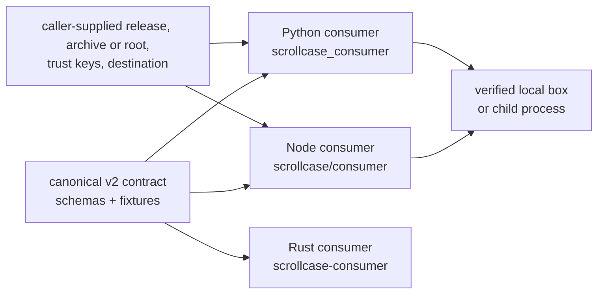
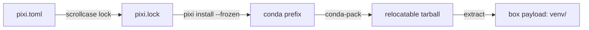
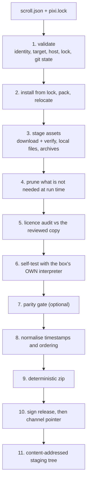

# Architecture

Scrollcase turns a declarative **scroll** into a **box**: a portable, locked, self-contained
Python environment for one operating system and accelerator, packed so it runs somewhere other
than where it was built, signed so a consumer can prove what they received, and accompanied by a
dependency licence inventory.

This page explains how, and — more usefully — *why each step is where it is*.

## The v2 consumer boundary

Scrollcase has one canonical contract and two local consumer implementations: the Node/TypeScript
API at `scrollcase/consumer`, the Python package imported as `scrollcase_consumer`, and the Rust
crate `scrollcase-consumer`.
`scrollcase run` delegates to the Node API instead of implementing a third path.



Every consumer must agree on verification, safe extraction, attachment across restarts,
installed-payload checking, execution, receipts, errors, signals, cleanup, and on-demand assets by
passing the same language-neutral conformance cases. Generated or checked schema copies are
projections of the canonical contract, never independent definitions.

The security order is fixed: validate the signed document and release shape, verify the archive
size and hash, validate every archive entry, extract safely, compare `box.json` with the signed
release, and validate execution prerequisites before starting box code. A consumer never launches
the interpreter, a script, a module, or an import earlier.

All inputs are local and caller-selected. Consumer code does not choose a channel, download a box,
update an installation, promote, revoke, publish, serve, allocate a runner, or own application
lifecycle policy.

A persistent installation earns a new process-bound receipt through attachment rather than loading
one from disk. Byte verification stays separate and opt-in: the signed release commits to the
`payload-digest.v1` list inside the box, and the verifier checks that list instead of treating later
extra files as corruption. The result is point-in-time integrity; operating-system permissions and
the embedding application remain responsible for guarding the directory afterwards.

## The substrate

One substrate, and only one: **pixi + conda-pack + conda-forge**.



`pixi` solves a committed `pixi.lock` against conda-forge, `conda-pack` relocates the resulting
prefix, and the tree is extracted into the box as `venv/`. There is deliberately no second
dependency backend — the reasoning is in [Why Pixi & Conda-Forge](/v2/concepts/why-pixi).

## The build pipeline



Each step earns its position:

**Validate first.** The complete nested scroll is checked against the shipped schemas before a
tool is probed, a fetch is made, or build state is mutated. Identity, target/entry-point,
weights/archive policy, native host, lock presence, and Git state follow in that order.

**Install, never resolve.** `pixi install --frozen` materialises exactly the locked packages
without touching or re-checking the lock, so what ships is byte-for-byte what was reviewed.
Resolution is a separate, human-initiated step (`lock`).

**Relocate.** See [below](#relocation).

**Stage assets.** Every declared asset is size- and hash-checked before it enters the payload.
Network retries within one download resume a partial file, which is renamed into place only after
its size and hash match. Build scratch is reset between processes; there is no persistent cache.

**Prune, then check.** Pruning keeps the box to what it needs at run time; `selfTest.files` is
what stops an over-aggressive prune from shipping a broken box.

**Audit before self-testing.** The licence inventory is derived from the lock and compared to the
reviewed copy. A licence problem is a legal problem, and it is cheaper to hit it before the
expensive checks.

**Self-test with the box's own interpreter.** The builder runs post-prune file assertions, the
target assertion, imports, and optional scroll `pythonCode`. Schema version 2 signs the target
assertion and import subset for a consumer to repeat; the richer scroll-only checks are not
misrepresented as consumer checks.

**Parity after the self-test, on the same payload.** There is no point comparing accelerators in
a box that cannot import its dependencies in the first place.

**Commit, normalise, then archive.** After `box.json`, the builder writes `payload-digest.v1` and
places the list's hash in the signed release. Timestamps are then stamped to a fixed instant and
files enumerated in one stable order, which is what makes the ZIP deterministic.

**Sign last, stage after.** The release commits to the archive by hash; the channel commits to
the release document by *its* hash. The staging tree is then laid out exactly as a bucket would
be, so whatever publishes it uses the keys the manifests already point to.

## The guarantees

Everything above exists to hold six promises. They are the product; features that would weaken
one are refused.

### Locked

The environment is a pure function of a committed `pixi.lock`. `build` installs; it never
resolves. A missing lock is a hard error rather than an invitation to resolve on the fly.

### Deterministic {#determinism}

Rebuilding the same commit produces a **byte-identical archive**. Three things make that true:

- timestamps are normalised to a fixed instant (`2000-01-01T00:00:00Z`) and files are enumerated
  in one stable order;
- the build time comes from the HEAD commit, not the clock — outside a git checkout it falls back
  to a constant, because a wall-clock fallback would reintroduce exactly the nondeterminism this
  avoids;
- the channel cohort salt is derived from `boxId` and `version` rather than randomly.

A test asserts this directly. Anything that varies per run — a clock read, a random value, an
unsorted directory listing — breaks it.

### Relocatable {#relocation}

conda-pack already replaces the build prefix with a neutral placeholder, and a conda-forge prefix
imports and runs from any location with no activation environment. So the box needs **no
relocation step at install time**, and the embedded `conda-unpack` fixer is deliberately never
run: doing so would stamp the build machine's absolute paths into dozens of files that then ship
to users — measured on a probe environment, zero files carried the build prefix before running it
and thirty-six after — leaking a developer's directory layout while still being wrong at the
user's install location.

Instead, four repairs happen at build time:

1. The few service files that carry the build prefix are removed
   (`conda-meta/pixi_env_prefix`, `bin/conda-unpack`, and friends).
2. Every symlink is settled: kept when it provably resolves, inside the payload, to a regular file;
   materialised into real content when it does not; dropped when it dangles or escapes the prefix,
   rather than pulling host files into the box. A link to a *directory* is always materialised —
   that is the only way an entry could be written through a link and land somewhere its own name
   does not describe, so a prefix whose links chain through directory links (icu's `current`, for
   instance) unpacks like any other. Keeping the rest matters: the soname convention alone stores
   every large shared library two or three times, and materialising all of it doubled an extracted
   Linux box. The rule lives in `src/contract/links.mjs` and is re-applied by every consumer against
   the archive as received, never trusted from the builder.
3. Generated console scripts, whose shebangs embed the build interpreter's absolute path, are
   rewritten to resolve Python next to themselves.
4. conda's per-package records in `conda-meta/` are reduced to name, version, build and licence,
   and its `history` log is dropped. As the installer writes them, those records name the build
   machine's package cache and vary between two installs of the same lock, which would leak a
   developer's paths and break the byte-identical rebuild. The kept fields
   are copied verbatim and chosen by allowlist, so a field a later pixi starts writing cannot
   reintroduce either problem. Nothing in a box reads them — conda is never shipped inside one, and
   package versions stay readable from `site-packages`.

### Signed

Every release and channel document travels in one envelope, with the payload as exact
base64-encoded JSON so that verifying a signature means hashing the bytes as transmitted. A local
ed25519 key works out of the box; an external signer plugs in through `--signer-command` and is
**not trusted on its word** — it must echo back the exact payload it was given, and its signature
is verified locally before the build continues. See
[Signing & Key Custody](/v2/guides/signing-and-custody).

### Verified

`verify` checks signature, archive size and hash, safe entry names, recursive agreement of all
shared schema-v2 manifest fields, and the declared interpreter. With `--self-test`, it temporarily
extracts and runs the signed import subset. It does not repeat scroll-only Python or file checks.

### Honest about provenance

A box records the commit it was built from and whether that tree was dirty, including untracked
files while respecting Git ignore rules. Building outside a git checkout **fails** rather than
inventing a revision; a dirty tree requires `--allow-dirty` and
is recorded as `sourceTreeDirty: true` in the box itself. A build that cannot be reproduced from
its recorded revision says so.

## The code

```text
src/
├── contract/          the box format itself — the source of truth
│   ├── targets.mjs      target model, identity rule, per-target adapters
│   ├── documents.mjs    signed-document envelope, namespacing
│   ├── payload-digest.mjs canonical extracted-entry list bytes
│   ├── schema/          eight JSON Schemas
│   └── fixtures/        golden fixtures other implementations prove themselves against
├── build/             solving, packing, staging, auditing, verifying
│   ├── pixi.mjs         tool discovery, argument vectors, install + pack + relocate
│   ├── launchers.mjs    the console-script repair
│   ├── archive.mjs      deterministic zip, defensive extraction
│   ├── filesystem.mjs   stable ordering, fixed timestamps, path safety
│   ├── assets.mjs       verified downloads, local files, archive expansion
│   ├── licenses.mjs     the lock-derived licence inventory
│   ├── workspace.mjs    project path resolution
│   ├── scroll.mjs       scroll reading and provenance
│   ├── box.mjs          the build core
│   ├── verify.mjs       the consumer's checks, run locally
│   ├── audit.mjs        the licence audit verb
│   ├── project.mjs      init and doctor
│   └── parity.mjs       the accelerator parity gate
├── consumer/          verified local preparation, attachment, checking and execution
│   ├── verify-and-extract.mjs  staged extraction, attachment, payload checking, opaque receipts
│   ├── run-extracted.mjs       interpreter invocation, assets, stdio, signals
│   └── run-box.mjs             one-shot temporary execution and cleanup
├── sign/              key generation, local signing, external dispatch, verification
└── cli.mjs            argument parsing and dispatch — thin, logic lives in the modules
rust/
├── src/                      the crate: contract mirror, verification, extraction, execution
├── fixtures/                 bundled copies of the shared fixtures, drift-checked
└── tests/                    contract, schema agreement, hostile archives, conformance
python/
├── src/scrollcase_consumer/  typed Python verification, extraction, and execution
├── scripts/                  schema sync and distribution inspection
└── tests/                    local signed-box and hostile-archive regressions
```

`src/contract/` is the source of truth for the format. Other languages **mirror** it and prove
the mirror against `fixtures/target-id-contract.json`; they do not import it. That is how the Rust
crate, a Worker, and this builder stay in agreement without sharing a runtime.

## Boundaries

Two boundaries hold everything else up.

**Paths come from the project, not from Scrollcase.** A `scrollcase.config.json` declares where
scrolls live and where artefacts go, discovered by walking up from the working directory,
overridable per invocation. A tool that derives its paths from its own location on disk only works
while it lives inside the project it serves; making the layout the project's declaration is what
lets Scrollcase run from anywhere against any project.

**The document namespace belongs to the publishing project.** Document kinds are
`<namespace>.release` / `.channel` / `.revocations`, defaulting to `scrollcase.box`. A project
with boxes already installed in the field keeps emitting the namespace its clients recognise, and
Scrollcase carries nobody's brand.

## What is deliberately outside

Publishing to object storage, serving or promoting a channel, revoking a release, allocating CI
runners, and model-specific scientific validation. Scrollcase stops at a signed, verified box on
disk — see [Distributing Boxes](/v2/guides/distributing-boxes) for what to build on top, and
[Design Decisions](/v2/concepts/design-decisions) for why each was left out.
